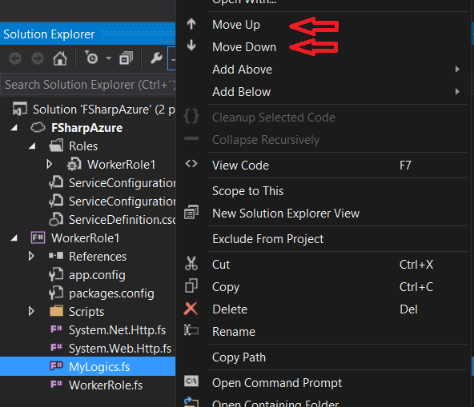

# Creating Azure Worker role #

Let's assume you have Visual Studio 2012 or Visual Studio 2013 installed and you have (the default) support for F#-language. Also you have installed the [Windows Azure SDK](http://www.windowsazure.com/en-us/downloads/):n.

Open the Visual Studio and select from the menu: File -> New -> Project

Type in to the search field **azure**

You may select "Windows Azure Cloud Service". Don't be bothered about the language selection, select any of those. Name your project and press ok.

The new dialogue opens, please select the **Visual F#**

Select "Worker Role" and **add it to the list (from the arrow-button)**, after that press OK. (If you directly press OK, it will create an empty solution.)

Now you should have created a new solution and you should have two projects in it:

 1. The project you named (with cloud icon), which is so called deployment-project: If you select this and press the right mouse button, there will be menu having item "Publish", which will publish the project to the Microsoft Azure.
 2. WorkerRole project (with F# icon), which is the source code project. There is already a class named WorkerRole.fs. The class just inputs "Working" every 10 seconds to the console when started.

Good, then just run the program. But it is unnecessary to send the program to the internet yet: you may run this from the emulator. (The emulator works "quite ok", so it is better to try to publish the projects to the Azure every now and then.)

To start the emulator, select from the menu Debug -> Start debugging, or press **F5**. The program loads a while and the emulator icon pops to the Systray (down-right corner of the Windows). Press a **right mouse button in the top of the emulator icon**, and select "Show Compute emulator UI".

Now you see the emulator user interface. Open the WorkerRole from the left side list and select it, so you get the console visible to the screen. When you press the top bar of the console, it will grow the window. Console should show some misc texts, but after a while there should appear the text "Working" in multiple times.

If so, congrats, your environment is OK. Next, some tools:

## Nuget-packages ##

Next, let's setup five components from the Nuget-package-management system. The easiest way is from the Visual Studio menu:

Tools -> Nuget Package Manager -> Manage Nuget Packages for Solution... -> Online

The packages are easiest to search by the Id from the search box of the upper right corner of the popup-window.

- [Microsoft ASP.NET Web API 2.1 OWIN SelfHost](http://www.nuget.org/packages/Microsoft.AspNet.WebApi.OwinSelfHost/)
	- Nuget-package-id:  **Microsoft.AspNet.WebApi.OwinSelfHost**
	- [OWIN](http://owin.org/) works as independent lightweight and powerful WWW-host.*
- [Microsoft ASP.NET SignalR](https://www.nuget.org/packages/Microsoft.AspNet.SignalR/)
	- Nuget-package-id: **Microsoft.AspNet.SignalR**
	- [SignalR](http://www.asp.net/signalr) is like Node.js of the .NET-environment. It makes two-way communication possible between the server and the client.* 
- [Microsoft Owin StaticFiles](http://www.nuget.org/packages/Microsoft.Owin.StaticFiles/)
	- Nuget-package-id: **Microsoft.Owin.StaticFiles**
	- Lightweight WWW-service-component to host static files. 
	- Works, but in production use it could be better option to deliver content from the Azure Blob Storage.
- [FSharp.Web.Http](http://www.nuget.org/packages/FSharp.Web.Http/)
	- Nuget-package-id: **FSharp.Web.Http**
	- [Frank](http://frank-fs.github.io/frank/)-library to ease Http and Web-API-communication with F#-language.
- [Fog](https://www.nuget.org/packages/Fog)
	- Nuget-package-id: **Fog**
	- [Fog](http://dmohl.github.io/Fog/) is a library to make using Azure easier from the F# language. It contains e.g. some caching.

As the packages has some updates, you may update those from the Updates-tab to the newest versions. (***Note:** When this tutorial was written, there was some conflicts in the Azure-component reference of hard-coded version number of the Microsoft.Data.Services.Client 5.6.0, but it could be fixed by temporarily switching the versions from the  packages.config-file 5.6.1 to 5.6.0 and then back.*)

## Adding some custom code files ##

Select the WorkerRole-project, press the right mouse button on top of it, and select Add -> New Item... -> Source File, and add a file to the project: MyLogics.fs
(You may discover some better name later.)

You can reference to a past code block in F#-language, but you can't reference to future code block, so order of your code blocks does matter. You can read the code as a book, from top to down. This means that order of the files in the projects matter as well. You may change the order by pressing right mouse over a file and then select "Move Up" or "Move down".

This limitation feels bad for C#-developer at first: By default you wont develop by jumping wildly around your code files. Correspondingly the development experience is not about jumping in the IDE with debugger having at least 10 files open.

Arrange your fs-files to this order (other files doesn't matter....):

1. System.Net.Http.fs
2. System.Web.Http.fs
3. MyLogics.fs
4. WorkerRole.fs

Try once again that the project compiles. Now you have the basic infrastructure and may begin the development... Just like in C#, different (file) namespace/module dependencies will need either full-name-reference or calling the open-command, which corresponds to the C#-using-command.

[Back to the menu](../ReadmeEng.html)
