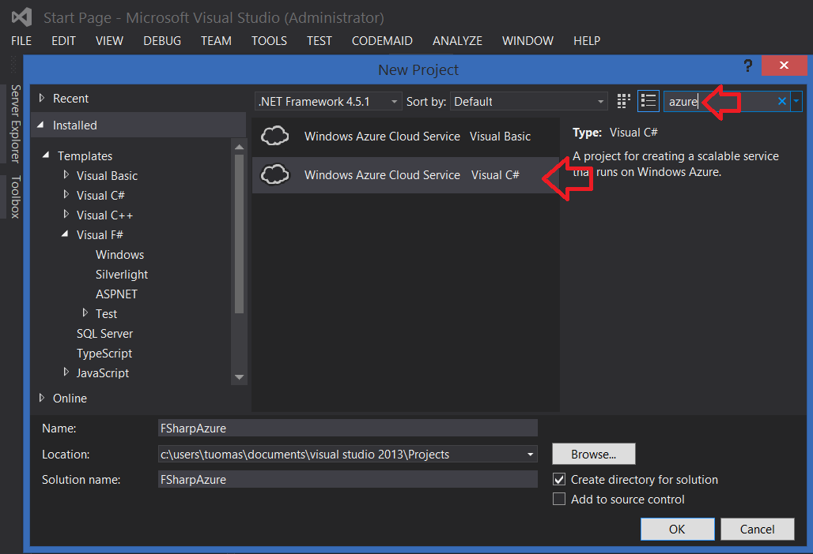
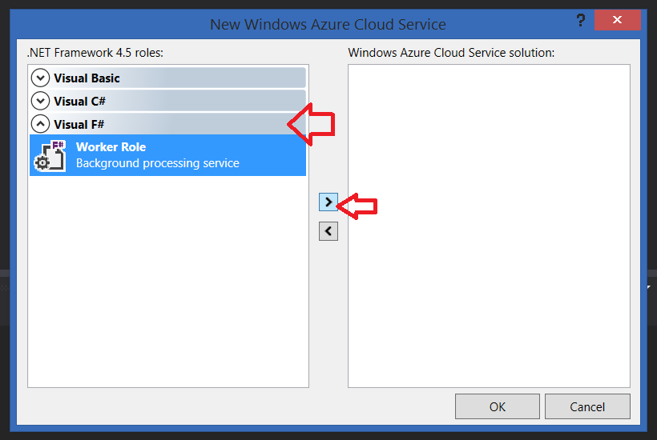
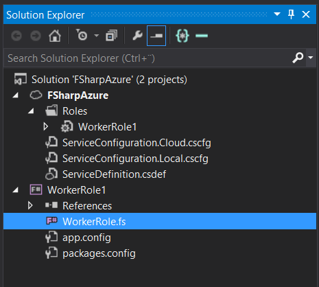
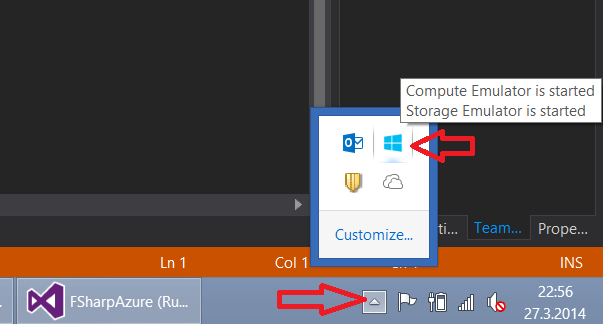
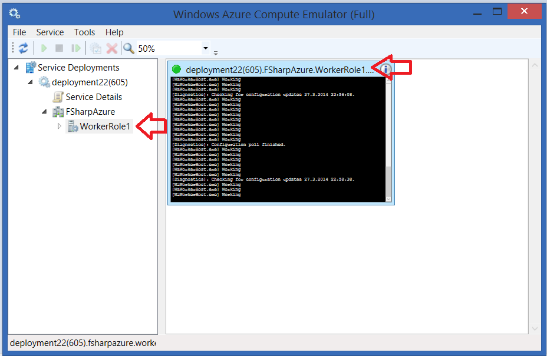

# Azure Worker -roolin luonti #

Oletetaan, että koneellasi on Visual Studio 2012 tai Visual Studio 2013 ja siihen asennettuna oletuksena mukana tuleva F#-kielen tuki. Lisäksi olet asentanut myös [Windows Azure SDK](http://www.windowsazure.com/en-us/downloads/):n.

Avaa Visual Studio ja valitse valikosta: File -> New -> Project

Kirjoita hakukenttään **azure**

Voit valita "Windows Azure Cloud Service". Älä hämäänny kielivalinnasta, voit valita kumman tahansa. Keksi projektillesi nimi ja paina ok.

Aukeaa uusi dialogi, valitse siitä **Visual F#**

Valitse Worker Role ja **lisää se nuolesta listaan**, vasta tämän jälkeen paina ok. (Jos vain suoraa ok, tulee tyhjä "solution".)

Nyt sinulla pitäisi olla luotu uusi "solution" ja siinä kaksi projektia:

 1. Valitsemasi niminen projekti (pilvikuvakkeella), joka on ns. deployment-projekti: Jos valitset tämän ja painaisit hiiren oikeaa nappia, tulee valikko, jossa on mm. "Publish"-nappi, josta projekti julkaistaan Windows Azureen.
 2. WorkerRole-projekti (F#-kuvakkeella), joka on itse lähdekoodiprojekti. Tänne on oletuksena tehty WorkerRole.fs-niminen koodiluokka. Kyseinen luokka ei tee muuta, kuin käynnistyessään kirjoittaa konsolille 10 sekunnin välein tekstin "Working".

Hyvä, sitten vain ohjelma käyntiin. Mutta tässä vaiheessa on vielä turha lähettää ohjelmaa nettiin: sen voi ensiksi ajaa emulaattorilla. (Emulaattori toimii "aika realistisesti", eli kannattaa kuitenkin aika-ajoin joskus julkaista myös Azureen, eikä sokeasti luottaa emulaattoriin.)

Emulaattorin saa käyntiin, kun joko valitsee valikosta Debug -> Start debugging, tai painaa **F5**. Ohjelma lataa hetken ja emulaattorin kuvake ilmestyy Windowsin oikean alakulman SysTray-palkkiin. Paina emulaattorin **kuvakkeen päällä hiiren oikeaa nappia**, ja valitse "Show Compute emulator UI".

Nyt aukeaa emulaattorin käyttöliittymä. Avaa vasemman puolen listasta WorkerRole ja valitse se, jolloin saat konsolin näkyville ruudulle. Konsolin yläpalkkia painaessa pomppaa konsoli isoksi näytölle. Konsolissa pitäisi näkyä aluksi sekalaista tekstiä, mutta hetken päästä siihen pitäisi alkaa tulostua säännönmukaisesti teksti "Working".

Jos näin on, onnittelut, ympäristösi on kunnossa... Lisätään vielä vähän työkaluja:

## Nuget-paketit ##

Seuraavaksi asennetaan projektiin neljä komponenttipakettia Nuget-pakettihallinnasta. Helpoimmin se tapahtuu Visual Studion valikosta:

Tools -> Nuget Package Manager -> Manage Nuget Packages for Solution... -> Online

Asennettavat paketit on helpoin hakea Id:n perusteella popup-ikkunan ylälaidan haulla.

- [Microsoft ASP.NET Web API 2.1 OWIN SelfHost](http://www.nuget.org/packages/Microsoft.AspNet.WebApi.OwinSelfHost/)
	- Nuget-paketti-id:  **Microsoft.AspNet.WebApi.OwinSelfHost**
	- [OWIN](http://owin.org/) toimii tässä itsenäisenä pienenä kevyenä ja tehokkaana WWW-palvelimena.*
- [Microsoft ASP.NET SignalR](https://www.nuget.org/packages/Microsoft.AspNet.SignalR/)
	- Nuget-paketti-id: **Microsoft.AspNet.SignalR**
	- [SignalR](http://www.asp.net/signalr) on vähän kuin Node.js kopioituna .NET:ille. Se mahdollistaa kaksisuuntaisen liikenteen www-palvelimen ja käyttäjän välillä.* 
- [Microsoft Owin StaticFiles](http://www.nuget.org/packages/Microsoft.Owin.StaticFiles/)
	- Kevyt WWW-palvelin-komponentti hostaamaan staattisia tiedostoja. 
	- Toimii, mutta tuotantokäytössä sisällön jakelu Azure Blob:ista voisi olla parempi ratkaisu.
- [FSharp.Web.Http](http://www.nuget.org/packages/FSharp.Web.Http/)
	- Nuget-paketti-id: **FSharp.Web.Http**
	- [Frank](http://frank-fs.github.io/frank/)-kirjasto helpottamaan Web-API-rajapinnan-luontia F#-kielellä.
- [Fog](https://www.nuget.org/packages/Fog)
	- Nuget-paketti-id: **Fog**
	- [Fog](http://dmohl.github.io/Fog/) on kirjasto helpottamaan Azuren käyttöä F#:lla, sisältäen mm. välimuistitusta.

Koska paketit ovat päivittyneet, voi vielä Updates-välilehdeltä käydä päivittelemässä ne uusimpiin versioihin. (Ainakin ohjeen kirjoittamishetkellä uudet versiot ovat myös ok.)

## Omien koodiluokkien lisääminen ##

Valitse WorkerRole-projekti, paina sen päällä hiiren oikeaa nappia, ja valitse Add -> New Item... -> Source File, ja lisää projektille tiedosto: MyLogics.fs
(Paremman nimen voi keksiä myöhemmin.)

F#-kielessä voit aina viitata menneeseen koodilohkoon, mutta et tulevaan, eli koodilohkojen järjestyksellä on väliä. Voit lukea koodia kuin kirjaa, ylhäältä alas. Tämä tarkoittaa myös sitä, että projektissa tiedostojen järjestyksellä on väliä. Voit muuttaa tiedostojen järjestystä painamalla tiedoston nimen päällä hiiren oikeaa nappia, ja "Move Up" tai "Move down".

C#-ohjelmoijalle tämä rajoite tuntuu aluksi pahalta: Lähtökohtaisesti ei ohjaudutakaan siihen, että koodissa voi poukkoilla miten haluaa. Vastaavasti koodaus ei muodostukaan siitä, että debugataan vähintään 10 tiedostoa auki pomppien villisti paikasta toiseen.

Järjestä nyt fs-tiedostot tähän järjestykseen (muilla ei ole väliä....):

1. System.Net.Http.fs
2. System.Web.Http.fs
3. MyLogics.fs
4. WorkerRole.fs

Koita vielä, että softa kääntyy. Nyt on perus-infra kunnossa ja voidaan aloittaa itse koodaaminen... Vastaavasti kuin C#:ssa, eri (tiedostojen) namespacejen/moduulien välillä pitää joko viitata kokonimellä tai kutsua open-käskyä, joka vastaa C#-using-käskyä.

[Takaisin valikkoon](../Readme.html)
