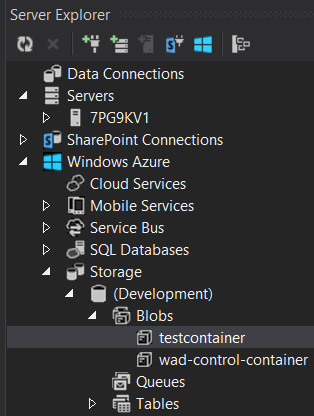

# Azure Blob- and Table Storage #

Let's use the WorkerRole from previous tutorials and also Windows Azure Storage -library.
(Earlier version of this tutorial used Fog-library but it didn't work well with the latest Azure SDKs.)

First task is to add connection strings to Azure storage. It is done like this:

Open the deployment-project file **ServiceDefinition.csdef** and add there settings: **TableStorageConnectionString** and **BlobStorageConnectionString**. In the Azure emulator -environment these can be empty. 

File content attribute `name="FSharpAzure"` refers to the name of the solution and  `schemaVersion="2013-10.2.2"` refers to the used AzureSDK, here 2.2, but 2.3 would be  `schemaVersion="2014-01.2.3"`and 2.4 would be `schemaVersion="2014-06.2.4"`.

	[lang=xml]
	<?xml version="1.0" encoding="utf-8"?>
	<ServiceDefinition name="FSharpAzure" 
	xmlns="http://schemas.microsoft.com/ServiceHosting/2008/10/ServiceDefinition"
	schemaVersion="2013-10.2.2">
	  <WorkerRole name="WorkerRole1" vmsize="ExtraSmall">
	    <Endpoints>
	      <InputEndpoint name="Endpoint1" protocol="http" port="80" localPort="80" />
	    </Endpoints>
	    <Imports>
	      <Import moduleName="Diagnostics" />
	    </Imports>
	    <ConfigurationSettings>
	      <Setting name="TableStorageConnectionString" />
	      <Setting name="BlobStorageConnectionString" />
	    </ConfigurationSettings>    
	  </WorkerRole>
	</ServiceDefinition>

Modify also the files **ServiceConfiguration.Cloud.cscfg** and **ServiceConfiguration.Local.cscfg** to contain the corresponding settings:
	
	[lang=xml]
	<?xml version="1.0" encoding="utf-8"?>
	<ServiceConfiguration serviceName="FSharpAzure" 
	xmlns="http://schemas.microsoft.com/ServiceHosting/2008/10/ServiceConfiguration"
	osFamily="4" osVersion="*" schemaVersion="2013-10.2.2">
	  <Role name="WorkerRole1">
	    <Instances count="1" />
	    <ConfigurationSettings>
	      <Setting name="Microsoft.WindowsAzure.Plugins.Diagnostics.ConnectionString" 
		  value="UseDevelopmentStorage=true" />
	      <Setting name="TableStorageConnectionString" value="UseDevelopmentStorage=true" />
	      <Setting name="BlobStorageConnectionString" value="UseDevelopmentStorage=true" />
	    </ConfigurationSettings>
	  </Role>
	</ServiceConfiguration>

For emulator, it is OK to use value="UseDevelopmentStorage=true", but in the production this connection-string should be something else. For this, there is tutorial in the [net](http://msdn.microsoft.com/library/azure/ee758697.aspx).

### Using F-Sharp script-files ###

Using these codes in interactive-environment works, but execution of the actual Azure-calls won't. So you may add to beginning of the file:

    [lang=fsharp]
    #if INTERACTIVE
    #r "../packages/Fog.0.1.4.1/Lib/Net40/Fog.dll"
    #r "System.Data.Services.Client.dll"
    #r "Microsoft.WindowsAzure.StorageClient.dll"
    #endif

Note that NuGet may have fetched you different version of the component than in this example. So if Visual Studio underlines the line with red, and says the file doesn't exist, this may be the result of you having newer version of the component, in another path. 
Another commonly used practice in F# is to add one file of type Script File (*.fsx) to the project. This runs only in interactive-style scripting but will be excluded from the actual compilation. These #r:s works also there and project's  .fs-files could be loaded like this: 

    [lang=fsharp]
    #load "MyLogics.fs"
    open MyLogics

## Caching and settings ##

This code works with Blob and Table -storages.
Open the logics file and add on this code to it:

    [lang=fsharp]
    module MyLogics
    
    open System
    open Microsoft.WindowsAzure.ServiceRuntime
    open Microsoft.WindowsAzure.Storage

    open System.Collections.Concurrent
    let dict = ConcurrentDictionary() //for caching

    let fetchSetting = RoleEnvironment.GetConfigurationSettingValue >> CloudStorageAccount.Parse

We use memoize for caching. Memoize/memoization caches the whole function call and not only input parameters like normal caching.
 
 
## Azure Blob Storage ##

Blob-storage is a simple data storage e.g. for files. Add this code under the previous:

    [lang=fsharp]
    let blobConnection (container:string) = 
        let account = fetchSetting "BlobStorageConnectionString"
        let client = account.CreateCloudBlobClient()
        client.GetContainerReference(container.ToLower())

    let uploadBlobToContainer containerName blobName (item:string) = 
        let memoize f = fun x -> dict.GetOrAdd(Some x, lazy (f x)).Force()
        let container = memoize(fun cont -> blobConnection cont) containerName
        async {
            let! ok = container.CreateIfNotExistsAsync() |> Async.AwaitTask
            let blob = container.GetBlockBlobReference(blobName)
            let enc = System.Text.Encoding.ASCII.GetBytes(item)
            use ms = new System.IO.MemoryStream(enc, 0, enc.Length)
            do! blob.UploadFromStreamAsync ms |> Async.AwaitIAsyncResult |> Async.Ignore
        }
    
    let addToBlob = uploadBlobToContainer "testContainer" "testBlob"

    open System
    open FSharp.Data
    let demoData =
        let ``scientist of the day `` = 
            FreebaseData.GetDataContext().Commons.Computers.``Computer Scientists``
            |> Seq.skip DateTime.Now.DayOfYear //
            |> Seq.head
        "Scientist of the day: " + ``scientist of the day ``.Name
    
Now you may call this from the WorkerRole.fs file's method wr.OnStart():

    [lang=fsharp]
    MyLogics.demoData |> MyLogics.addToBlob

When you start the program (F5), you may find from **Server** Explorer (not Solution Explorer) that (after refresh) there has been appeared a blob which you can double-click to open, and there is the blob-list that you can again double-click to open the data itself:

## Azure Table Storage ##

Azure Table Storage is NoSQL-minded data storage.

Here is a code sample to use it:

    [lang=fsharp]
    let ``Azure dvd table`` = "Dvd"

    [<Measure>]
    type stars

    open Microsoft.WindowsAzure.Storage.Table

    type MyDvdEntity(partitionKey, rowKey, name, rating) = 
        inherit TableEntity(partitionKey, rowKey)
        new(name, rating) = MyDvdEntity("defaultPartition", System.Guid.NewGuid().ToString(), name, rating)
        new() = MyDvdEntity("", 0<stars>)
        member val Name = name with get, set
        member val Rating = rating with get, set

    let tableConnection tableName = 
        let account = fetchSetting "TableStorageConnectionString"
        let client = account.CreateCloudTableClient()
        client.GetTableReference(tableName)

    let doAction tableName operation = 
        let memoize f = fun x -> dict.GetOrAdd(Some x, lazy (f x)).Force()
        let table = memoize(fun tb -> tableConnection tb) tableName
        async {
            let! created = table.CreateIfNotExistsAsync() |> Async.AwaitTask
            return! table.ExecuteAsync(operation) |> Async.AwaitTask
        }

    let addDvd name rating = 
        let dvd = MyDvdEntity(
                    PartitionKey = "myPartition",
                    RowKey = System.Guid.NewGuid().ToString(),
                    Name = name,
                    Rating = rating
                  )
        dvd, dvd
        |> TableOperation.Insert //Insert, Delete, Replace, etc.
        |> doAction ``Azure dvd table``
        |> Async.RunSynchronously

    let updateDvd dvd = 
        dvd |> TableOperation.Replace |> doAction ``Azure dvd table`` |> Async.RunSynchronously

    let deleteDvd dvd = 
        dvd |> TableOperation.Delete |> doAction ``Azure dvd table`` |> Async.RunSynchronously

...and corresponding calls to WorkerRole.fs to OnStart-method before base.OnStart, e.g.:

    [lang=fsharp]
    let dvd, result = MyLogics.addDvd "Godfather" 4<stars>
    dvd.Rating <- 5<MyLogics.stars>
    let result2 = MyLogics.updateDvd dvd

The actual Table Storage [query language is very limited](http://msdn.microsoft.com/en-us/library/windowsazure/dd135725.aspx) and the new Table Service Layer doesn't support LINQ so the queries has to be done with TableOperation.Retrieve-method, or constructing separate TableQuery and execute it with ExecuteQuery-method.

[Back to the menu](../ReadmeEng.html)