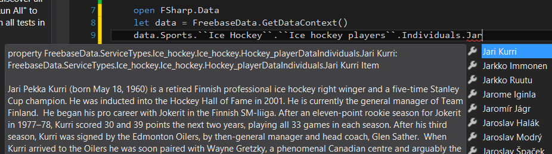
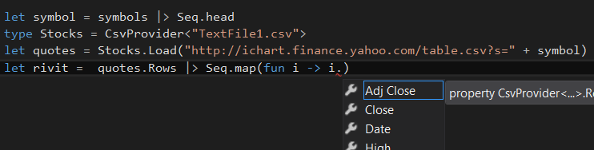

# Information Rich Programming Language #

The 3.0 version of F#-compiler is able to compile different data sources as part of the programming language type system. So the developer will get e.g. intellisense (code-write-time syntax checking).

There exists these "TypeProviders" for example:

- **JSON** data source (and **XML** data source)
	- Basic-web-service schemas. A bit like generating service references, but compiler does it for you.
- **CSV**-files
	- Raw online-data is widely served as CSV-feed. 
- **FreeBase**-internet-database
	- Freebase is an internet database, which aggregates information from several data sources. You won't easily get data structures from here, nor real-time-data, but a lot miscellaneous data-lists.
- **WorldBank**
	- World Bank is organization under United Nations. World Bank offers data from different countries.
- **SQL**-server
	- Like generating EntityFramework data model, but again, compiler takes care of everything, you can't poke and mess with it, which is a good thing.
- **Azure Marketplace**
	- If you want to for example buy a ready-made domain-model and focus only to your core business logics.
	- [http://datamarket.azure.com/browse/data?price=free](http://datamarket.azure.com/browse/data?price=free)
- And you can make your own TypeProvider...

Test a few, using [FSharp.Data](http://fsharp.github.io/FSharp.Data/)-library. You may use the same earlier WorkerRole-project. (You need an internet connection and when using these, Visual Studio may ask permission to use internet. If so, respond "Enable".)

## FreeBase TypeProvider ##

You can use interactive to test the code below (but the file path has to correspond the used NuGet-package version, here 2.0.5):

	[lang=fsharp]
    #if INTERACTIVE
    #r "../packages/FSharp.Data.2.0.7/lib/net40/FSharp.Data.dll"
    #endif

    open FSharp.Data
    let data = FreebaseData.GetDataContext()
    let Helsinki10 = 
        data.Commons.Business.``Stock exchanges``.Individuals.OMXH.``Companies traded``
        |> Seq.take 10
        |> Seq.map (fun company -> company.``Ticker symbol``)

    let iterated = Helsinki10 |> Seq.iter System.Console.WriteLine

Test also other sets under "data." and "data.Commons.". Note the Visual Studio Intellisense while you type:

Using this TypeProvider more will require API-key as a parameter to GetDataContext().

## CSV TypeProvider ##

The previous gave the listing of symbols in Helsinki Stock Exchange.

CSV-type-provider works common way for TypeProviders:

1. You need a hard-coded Schema, the form of the data. This is usually some kind of sample of old data, which is referred from development code.
	- Add a new file to the project, TextFile1.csv
	- Save this to its content:

		    Date,Open,High,Low,Close,Volume,Adj Close
		    2012-01-27,29.45,29.53,29.17,29.23,44187700,29.23
		    2012-01-26,29.61,29.70,29.40,29.50,49102800,29.50
		    2012-01-25,29.07,29.65,29.07,29.56,59231700,29.56
		    2012-01-24,29.47,29.57,29.18,29.34,51703300,29.34
    

2. You need source of real-time data
	- Let's use [Yahoo Finance](http://ichart.finance.yahoo.com/)-service. There exists a lot of corresponding internet services, but this is also what others are using.

So, continue to previous logics: you can now fetch data with the following code:

	[lang=fsharp]
    let symbol = "NOK" // symbols |> Seq.head
    type Stocks = CsvProvider<"TextFile1.csv">
    let quotes = Stocks.Load("http://ichart.finance.yahoo.com/table.csv?s=" + symbol)
    let ``Last day in USD`` =  quotes.Rows |> Seq.head

Unfortunately the USD-EUR exchange rate of Yahoo was not up-to-date, so it has to be fetched from somewhere else.

If you typed the file name TextFile1.csv correctly, then intellisense will work and you will get the right column names and even data types (System.DateTime, decimal, etc.):

## Exercises ##

#### Exercise 1 ####

Create a quiz-program that asks "which one was a president":
> Which one was a president, Richard Burton or Gerald Ford?

Program functionality:

1. From Freebase (under Commons.Government) get a list of presidents of the USA. Select only names.
	- Place those to temp-variable to avoid querying the source too often.
2. From Freebase (under Commons.Film) get a list of actors. Select only names. Take only 50 first ones.
	- Place those to temp-variable to avoid querying the source too often.
3. Question-function:
	- Take one random name from both of the lists and ask those (in random order) as a form of "Which one"-question.
4. Check the answer -function:
	- Take a name as parameter and check if the corresponding name is in the list of presidents.

#### Exercise 2 ####
The world is full of open APIs:
 
- Probably all the great corporations like YouTube, Amazon, jne.
- [Helsinki area mass transit](http://developer.reittiopas.fi/pages/en/http-get-interface-version-2.php), 
- [Ontologia API](http://onki.fi/api/v2/http/#reposearch) 
- [Ninchat API](https://github.com/ninchat/ninchat-api/blob/v1/api.md)
- [Finance-feed-listing](http://en.wikipedia.org/wiki/List_of_financial_data_feeds)
- BTC: [Quandl](http://www.quandl.com/api/v1/datasets/BITCOIN/MTGOXUSD.csv?&trim_start=2010-07-17&trim_end=2013-07-08&sort_order=desc), [BTC-e](https://btc-e.com/api/2/btc_usd/trades), [LocalBitcoins](https://localbitcoins.com/api-docs/)

Register as a user to one of these and explore the API-interface with  [JSON-TypeProvider](http://fsharp.github.io/FSharp.Data/library/JsonProvider.html).

If you often use SQL-server, you could use SqlEntityConnection-TypeProvider.

[Back to the menu](../ReadmeEng.html)